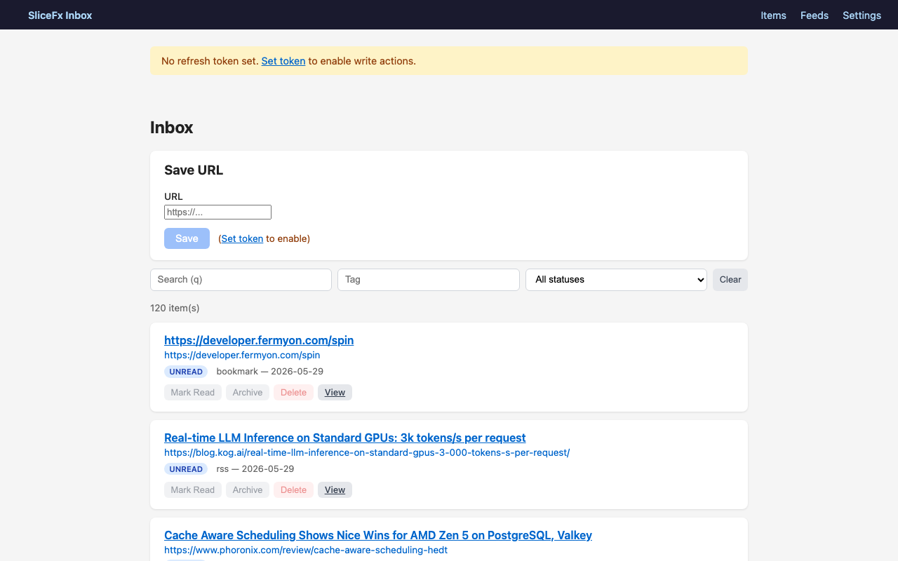

# slicefx-inbox

[English](README.md)

> この日本語版は参考訳です。仕様・リリース情報・セキュリティ上の判断は英語版 `README.md` を正本とします。

個人用 read-later + RSS inbox（マルチ workspace）— [SliceFx](https://github.com/sano-suguru/slicefx) を [Fermyon Cloud](https://cloud.fermyon.com)（Spin WASI）上でドッグフーディングするアプリです。

[](https://slicefx-inbox-1gat4stw.fermyon.app/)

**Live**: <https://slicefx-inbox-1gat4stw.fermyon.app/> · [About ページ](https://slicefx-inbox-1gat4stw.fermyon.app/about/)



## 何ができるか

- **ブックマーク**: `POST /api/items {url}` → Spin key-value に保存し、OG タイトルを自動取得します
- **read-later リスト**: `GET /api/items`（フィルタ: `?q=`, `?tag=`, `?status=`）、`GET /api/items/{id}`、`DELETE /api/items/{id}`
- **タグとステータス**: `PATCH /api/items/{id} {status?, tags?}` — 既読/アーカイブ化、タグ追加
- **SPA**（Blazor WASM、`spin-fileserver` 経由で same-origin 配信）:
  Login ページ（workspace 作成 / token 貼り付け / demo を試す）、アイテム一覧 + 検索/フィルタ、
  URL 追加、既読/アーカイブ/削除、feed 購読、手動リフレッシュ。
- **マルチ workspace**: 各ユーザーは、server が発行する opaque token で識別される匿名のプライベート workspace を持ちます。
  すべての endpoint（GET を含む）が `X-Workspace-Token` を要求します。
- **RSS 自動取り込み** — Spin cron trigger（ローカル）/ GitHub Actions スケジューラ（Fermyon Cloud）

## 必要環境

- .NET 10 SDK (`10.0.300`)
- [Spin CLI](https://developer.fermyon.com/spin/install) — ローカル実行と Fermyon Cloud デプロイに使用

## クイックスタート

### ローカルでビルド & 実行

```bash
# 1. Build the solution (non-WASI)
dotnet build Inbox.slnx

# 2. Publish the WASI server component (-> dist/inbox-server.wasm)
#    linux-x64 / win-x64 host required; macOS: use Docker linux/amd64
dotnet publish src/Inbox.Server -r wasi-wasm -c Release

# 3. Publish the Blazor WASM client (served by spin-fileserver)
dotnet publish src/Inbox.Client -c Release

# 4. Run with Spin (cron_token is required; any value works for local testing)
#    spin.toml includes a cron trigger — install the plugin once if needed:
#    spin plugin install trigger-cron
SPIN_VARIABLE_CRON_TOKEN=dev-secret spin up --file src/Inbox.Server/spin.toml
```

ブラウザで `http://localhost:3000/` を開きます。
- `/login` — workspace を作成するか、demo を試して token を取得します。
- `/` が SPA、`/api/...` が API です（same-origin のため CORS 不要）。

### API スモークテスト (curl)

```bash
# Create a workspace (no auth required) — returns token once
TOKEN=$(curl -fsS -X POST http://localhost:3000/api/workspaces | jq -r .Token)

# Add an item
curl -X POST http://localhost:3000/api/items \
     -H "Content-Type: application/json" \
     -H "X-Workspace-Token: $TOKEN" \
     -d '{"url":"https://example.com"}'

# List items
curl http://localhost:3000/api/items -H "X-Workspace-Token: $TOKEN"

# Try the shared demo workspace
DEMO_TOKEN=$(curl -fsS -X POST http://localhost:3000/api/demo | jq -r .Token)
curl http://localhost:3000/api/items -H "X-Workspace-Token: $DEMO_TOKEN"
```

## Fermyon Cloud へのデプロイ

推奨は GitHub Actions ワークフローによる手動デプロイです：

```bash
# main の最新 HEAD からデプロイ
gh workflow run deploy

# 特定コミットへのロールバック
gh workflow run deploy --ref <sha>
```

ワークフロー（`.github/workflows/deploy.yml`）は build + test → Blazor client publish →
WASI component publish（linux-x64 ネイティブ）→ `spin cloud deploy` の順で実行します。
リポジトリ secret `FERMYON_CLOUD_TOKEN`（Fermyon Cloud personal access token）が必要です。
cloud.fermyon.com → User Settings → Personal Access Tokens で作成し、repo secret に登録してください。

**フォールバック: 手動 CLI デプロイ**（linux-x64 / win-x64 ホスト、macOS は Docker を使用）：

```bash
# 1. Publish the Blazor WASM client
dotnet publish src/Inbox.Client -c Release

# 2. Publish the WASI server component
#    On macOS, use Docker linux/amd64:
docker run --rm --platform linux/amd64 -v "$PWD":/work -w /work \
  mcr.microsoft.com/dotnet/sdk:10.0 \
  dotnet publish src/Inbox.Server -r wasi-wasm -c Release
#    Outputs: src/Inbox.Server/dist/inbox-server.wasm

# 3. Deploy (uses spin.cloud.toml — HTTP-only, no cron trigger)
spin cloud login          # first time only
spin cloud deploy --file src/Inbox.Server/spin.cloud.toml
```

> Fermyon Cloud は cron trigger をサポートしていません。feed のリフレッシュは GitHub Actions の
> スケジュール（`.github/workflows/feed-refresh.yml`、30 分ごと）が `X-Cron-Token` 付きで
> `POST /api/feeds/refresh-all` を呼び出すことで行われます。

## 使用している SliceFx パッケージ

| Package | Version |
|---|---|
| `SliceFx.Core` | 0.1.0-preview.12 |
| `SliceFx.Wasi` | 0.1.0-preview.12 |
| `SliceFx.Wasi.KeyValue` | 0.1.0-preview.12 |
| `SliceFx.Wasi.HttpClient` | 0.1.0-preview.12 |
| `SliceFx.Wasi.Spin` | 0.1.0-preview.12 |
| `SliceFx.SourceGenerator` | 0.1.0-preview.12 |

## 動作しているもの

- ✅ **ブックマーク** — POST/GET/DELETE items、Spin key-value store
- ✅ **read-later リストとフィルタ** — `?q=`, `?tag=`, `?status=`、Blazor WASM SPA（`spin-fileserver` 経由の same-origin）
- ✅ **タグとステータス** — PATCH `/api/items/{id}`、既読・アーカイブ化、タグ追加/削除
- ✅ **RSS 自動取り込み** — feed 購読、cron trigger（ローカル Spin）/ GitHub Actions スケジューラ（Fermyon Cloud）
- ✅ **マルチ workspace 認証** — KV lookup による workspace ごとの opaque token、全 endpoint が認証必須
- ✅ **workspace 分離** — 各 workspace のデータは `w:{wid}:*` キー配下に格納、分離はテストで検証済み
- ✅ **in-process テスト + CI** — xUnit handler テスト、GitHub Actions による build/test ゲート
- ✅ **OG タイトル取得** — `POST /api/items` が保存 URL から `og:title` / `<title>` を取得（best-effort）
- ✅ **完全生成の typed client** — `slicefx client csharp` が生成する `SliceApiClient.g.cs`

実装ノートは [CLAUDE.md](CLAUDE.md)（英語）を参照してください。

## 既知の制限

- **OG タイトル取得は best-effort です**: https のリダイレクトは最大 3 ホップまで追跡し、http:// は追跡しません。
  デコードは UTF-8 のみ — UTF-8 以外のページではタイトルが文字化けする可能性があります。失敗時は URL をフォールバックとして使用します。
- **token は KV に平文のまま格納されます**: WASI NativeAOT-LLVM では `System.Security.Cryptography` が
  利用できないため、token をハッシュ化できません。KV の読み取りアクセス = 全 token の露出です。
- **`Guid.NewGuid()` のエントロピーはこの WASI ランタイムで未確認です**。token は衝突マージンのために
  GUID を 2 つ連結して使用します — これは衝突耐性 (collision resistance) を向上させますが、RNG が弱い場合の
  予測耐性 (prediction resistance) は向上しません。
- **KV のリスト取得は prefix scan です**: item・feed・workspace の一覧は、可変の index キーではなく
  `get-keys` の prefix scan から導出され、read-modify-write による lost-update 競合を排除しています。
  トレードオフはリスト呼び出しごとの O(total keys) です（ドッグフード規模では許容範囲）。
  並行する feed リフレッシュ（cron + 手動）は、競合時に同じエントリを二重に取り込む可能性が残ります
  （dedup は best-effort なスナップショット方式）。workspace 数の上限チェック（`MaxWorkspaces`）には
  従来と同じ TOCTOU の注意点が残ります。
- **demo は共有の読み書き可能空間です**: すべての訪問者が同じ demo token を取得し、コンテンツを変更・削除できます。
  demo token を使って server-side の OG 取得を匿名でトリガーできます。
- **パブリックなセルフ登録**は無効化できます: `spin cloud variables set registration_open=false`。
  追加の悪用ガードとして workspace 数 1000 のハードキャップがあります。
